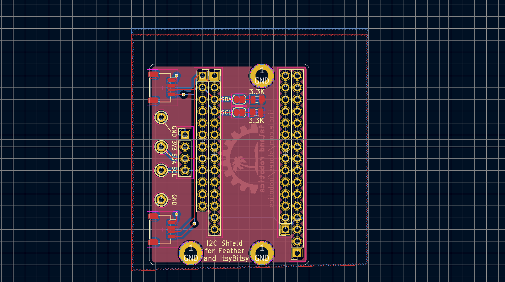

# i2c-shield

 An I2C shield for Feather and ItsyBitsy boards, making it easy to connect I2C devices to boards without Stemma QT/Qwiic connectors without fiddling with breadboard.

It is similar to this product by Sparkfun: https://www.sparkfun.com/products/16790 but provides more features:

* can be used with Feather or ItsyBitsy boards

* provides two Qwiic/Stemma QT connectors, and a male 4-pin header

* provides pull-up resistors (3.3K) on SDA and SCL lines. They  
  can be disconnected by breaking the solder bridge next to
  them using a sharp knife or a similar tool.

*  provides  four test points (Keystone 5000 or compatible, e.g. https://www.adafruit.com/product/3824),
   for connecting oscilloscope probes - very handy when you need to debug I2C connection.

The board is designed in KiCad 6.0  RC1.

